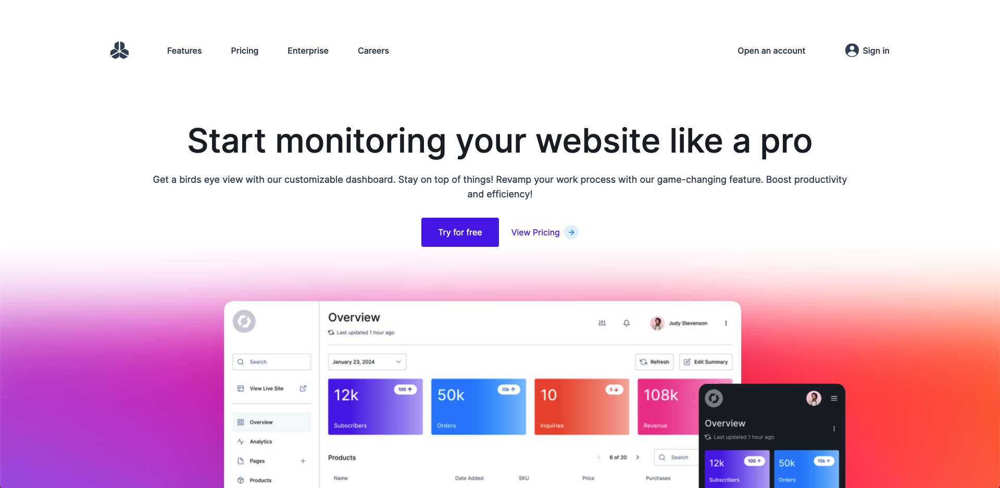
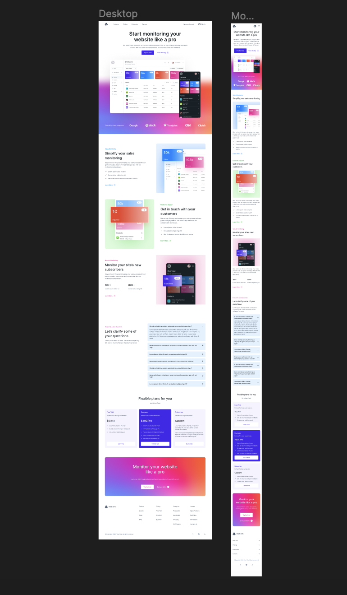

# Saas landing Page

**[DEMO LINK](https://saas-landing-page-one.vercel.app)**

A SaaS landing page, utilizing a mobile-first approach, to bring a meticulously crafted Figma design to life. Leveraging the power of Next.js and the flexibility of Tailwind CSS, I ensured a seamless and responsive user experience.

## Main Learning Points:

- Mobile-First Design: Prioritizing mobile responsiveness, the landing page is designed to deliver an optimal experience across a variety of devices, reflecting a commitment to accessibility and usability.

- Next.js for Performance: The project is built on Next.js, a powerful React framework, ensuring enhanced performance and a smooth user navigation experience. The server-side rendering capabilities of Next.js contribute to faster load times and improved SEO.

- Tailwind CSS Styling: The use of Tailwind CSS allowed for rapid and efficient styling, resulting in a visually appealing and modern interface. The utility-first approach of Tailwind facilitated quick iterations and a consistent design system.

- Figma Design Integration: Bringing the Figma design to life required attention to detail and precision. I meticulously translated the design elements into functional components, ensuring a pixel-perfect representation of the original vision.

## Built with:

- Next.js
- Tailwind
- Figma

